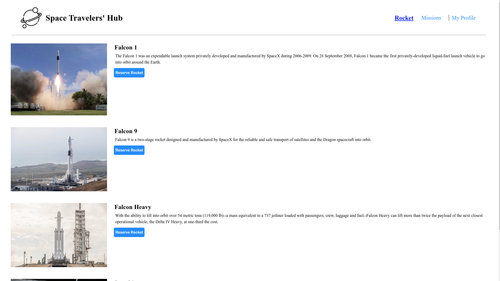

<a name="readme-top"></a>

<div align="center">

  <h3><b>Space Travelers</b></h3>

</div>

<!-- TABLE OF CONTENTS -->

# 📗 Table of Contents

- [📖 About the Project](#about-project)
- - [Live Demo](#live-demo)
- - [🛠 Built With](#built-with)
    - [Tech Stack](#tech-stack)
    - [Key Features](#key-features)
- [💻 Getting Started](#getting-started)
  - [Setup](#setup)
  - [Prerequisites](#prerequisites)
  - [Install](#install)
  - [Usage](#usage)
  - [Run tests](#run-tests)
- [👥 Author](#author)
- [🔭 Future Features](#future-features)
- [🤝 Contributing](#contributing)
- [⭐️ Show your support](#support)
- [🙏 Acknowledgements](#acknowledgements)
- [📝 License](#license)

<!-- PROJECT DESCRIPTION -->

# 📖 Space Travelers <a name="about-project"></a>


**[Space Travelers]** is a project that was created inline with the Microverse curriculumn. This app shows a list of rockets that can be reserved and missions that can be joined. As the user clicks on the various NavLinks, the different components are rendered. Data is fetched from the API and set as the new state. The components then access the data and render it using child components created in react. Global state is managed through Redux. I used React and redux in this project. 

# Live Demo <a name="live-demo"></a>

The project can be viewed live on the link below:

[View project](https://space-travelershub.onrender.com)

<p align="right">(<a href="#readme-top">back to top</a>)</p>
.

## 🛠 Built With <a name="built-with"></a>
### Tech Stack <a name="tech-stack"></a>


<details>
  <summary>Client</summary>
  <ul>
    <li>HTML and CSS</li>
    <li><a href="https://reactjs.org/">React</a></li>
  </ul>
</details>

<!-- Key Features -->

.

### Key Features <a name="key-features"></a>
It's main features are: 
- **[Navigation]** 
This allows the users to access the different sections of the app onclick. Uses react router.
- **[Rockets]**
This is the welcome page that shows the list of rockets that a user can reserve. A user can also cancel reservations.
- **[Missions_Table]**
This table shows the list of missions that a user can join. After joining a mission, a button to leave the mission appears which cancels a mission.
- **[My_Profile]**
This shows the compiled list of missions and rockets that a user has joined and reserved respectively.

<p align="right">(<a href="#readme-top">back to top</a>)</p>

<!-- GETTING STARTED -->

## 💻 Getting Started <a name="getting-started"></a>

##### To get a local copy up and running, follow these steps.

### Prerequisites <a name="prerequisites"></a>
In order to set up a local copy of this repository, you need to have git installed: 

[Install Git](https://git-scm.com/book/en/v2/Getting-Started-Installing-Git) <a name="install"></a>

### Setup <a name="setup"></a>

Clone this repository to your desired folder:


Example commands:

```sh
  mkdir my-folder
  cd my-folder
  git clone https://github.com/Christelle-12/space-travelers.git
  npm install
```
-

### Usage <a name="usage"></a>

To run the project:

  Run 
  ```sh
    npm start
  ```

### Tests <a name="run-tests"></a>
Tests can be performed by running "npm install" and then "npm test".

<p align="right">(<a href="#readme-top">back to top</a>)</p>

<!-- AUTHORS -->

## 👥 Author <a name="author"></a>

👤 **Benson Njuguna**

- GitHub: [@bennyjoez](https://github.com/bennyjoez)
- Twitter: [@bennyjoezz](https://twitter.com/bennyjoezz)

👤 **Nirere Marie Christelle**
- GitHub: [@Christelle-12](https://github.com/Christelle-12)
- Twitter: [@Chr1Nirere](https://twitter.com/Chr1Nirere)
- LinkedIn :[LinkedIn](https://www.linkedin.com/in/nirere-marie-christelle-9b139823b/)


<p align="right">(<a href="#readme-top">back to top</a>)</p>

<!-- FUTURE FEATURES -->

## 🔭 Future Features <a name="future-features"></a>
I plan to add the following features:

- [ ] **[Contact]**
- [ ] **[Completed_missions]**
- [ ] **[Travel_history]**

<p align="right">(<a href="#readme-top">back to top</a>)</p>

<!-- CONTRIBUTING -->

## 🤝 Contributing <a name="contributing"></a>

Contributions, issues, and feature requests are welcome!

Feel free to check the [issues page](https://github.com/Christelle-12/space-travelers/issues).

<p align="right">(<a href="#readme-top">back to top</a>)</p>

<!-- SUPPORT -->

## ⭐️ Show your support <a name="support"></a>

If you like this project, you can show your support by giving this project's repository a star on [github](https://github.com/Christelle-12/space-travelers/). 

<p align="right">(<a href="#readme-top">back to top</a>)</p>

<!-- ACKNOWLEDGEMENTS -->

## 🙏 Acknowledgments <a name="acknowledgements"></a>

I would like to thank Microverse for the outstanding collection of information they have provided that enabled me to create the project. In addition, I would like to also thank the team for outstanding work in implementing the requirements of this project. 


<!-- LICENSE -->

## 📝 License <a name="license"></a>

This project is [MIT](https://github.com/Christelle-12/space-travelers/blob/f13cdd834cdeac642a7443cd8bbea2be91bcebc1/LICENSE.md) licensed.

<p align="right">(<a href="#readme-top">back to top</a>)</p>